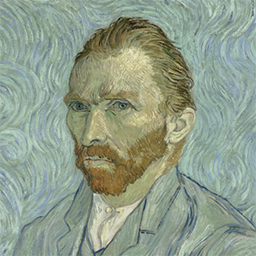

# Style transfer using deep artificial neural networks

This tutorial is one of the demos used in the course “Introduction to Machine Learning” at MINES ParisTech - 
PSL Research University, lectured by [Simon Tamayo](https://www.mines-paristech.fr/Services/Annuaire/simon-tamayo).

Here is what Style transfer looks like:

1. You have an _input_image_:

 

2. You have an _input_style_ (that you want to apply to your image):

 

3. The output a new image with keeps the features of your _input_image_ while changing its style:

 

## Acknowledgement

Most of this demo was adapted from the PyTorch tutorial on Style Transfer (https://pytorch.org/tutorials/advanced/neural_style_tutorial.html), which explains how to implement the Neural-Style algorithm developed by L. A. Gatys, A. S. Ecker and M. Bethge.

## Getting Started

Before running this code make sure you have Python3 and the packages: PyTorch, PIL, TorchVision and Matplotlib.

## VGG19

This tutorial uses the convolutional neural network VGG-19, which was trained on more than a million images from the [ImageNet database](http://www.image-net.org). The network is 19 layers deep and can classify images into 1000 object categories

## Built With

* [PyTorch](https://pytorch.org) - Deep learning platform
* [TorchVision](https://pytorch.org/docs/stable/torchvision/index.html) - package withpopular datasets and model architectures for computer vision.

This project is licensed under the MIT License - see the [LICENSE.md](https://opensource.org/licenses/mit-license.php) file for details.
